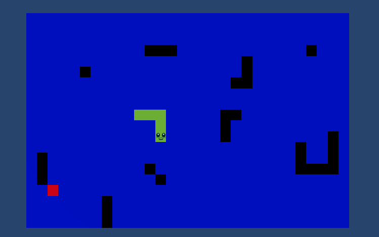

<div style="text-align: center;">

<h2 align="center">



Snake Game
</h2>

  <p style="text-align: center;">
    Classic Snake game in Unity with map generation and swipe movement
  </p>
</div>

### Features
* Dynamic map generation
* Easy to add obstacles
* Swipe ability for moving snake

### Built With
[![C#]][C#-url]

### Dependencies Used
* Unity 2022.3.10f1
* Zenject

<!-- GETTING STARTED -->
## Getting Started

### Prerequisites
* **.NET SDK:** You can download it from the [Microsoft website](https://dotnet.microsoft.com/download).

### Installation (for local)

1. **Clone the repo:** Use the following command to clone this repo to your local machine
   ```sh
   git clone https://github.com/BlueBatRay2/UnitySnakeGame
   ```
   **Alternative method:** download zip from https://github.com/BlueBatRay2/UnitySnakeGame and extract.
   <br/><br/>
2. **Open Project:** Navigate to folder and open project in Unity Hub
   ```sh
   cd UnitySnakeGame
   ```
3. **Run Project:** Press play and run.
4. **Have Fun!**

## How to Play

#### Keyboard
* `WASD` or `Arrow keys` or `Mouse swipe` controls the snake

[C#]: https://img.shields.io/badge/c%23-%23239120.svg?style=for-the-badge&logo=c-sharp&logoColor=white
[C#-url]: https://learn.microsoft.com/en-us/dotnet/csharp/

## Possible Improvements Considered

- Refactor `InputManager` to be abstracted out
- Add far more unit tests for code coverage


